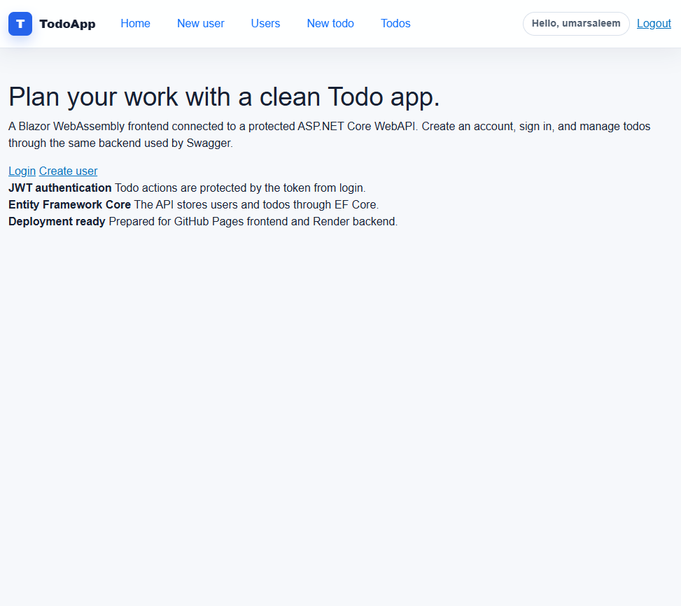
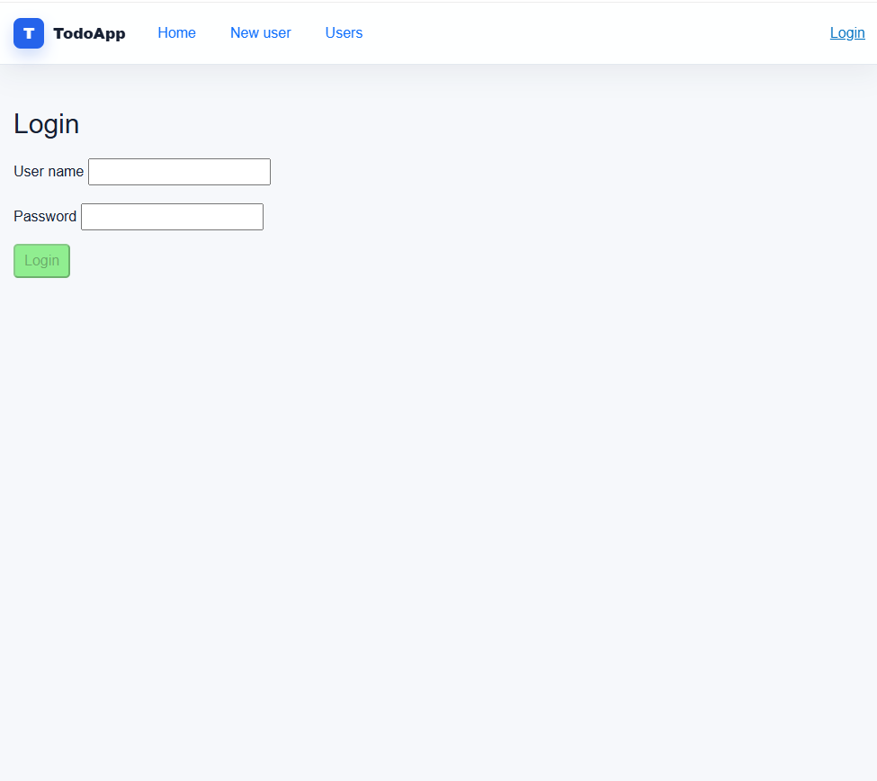
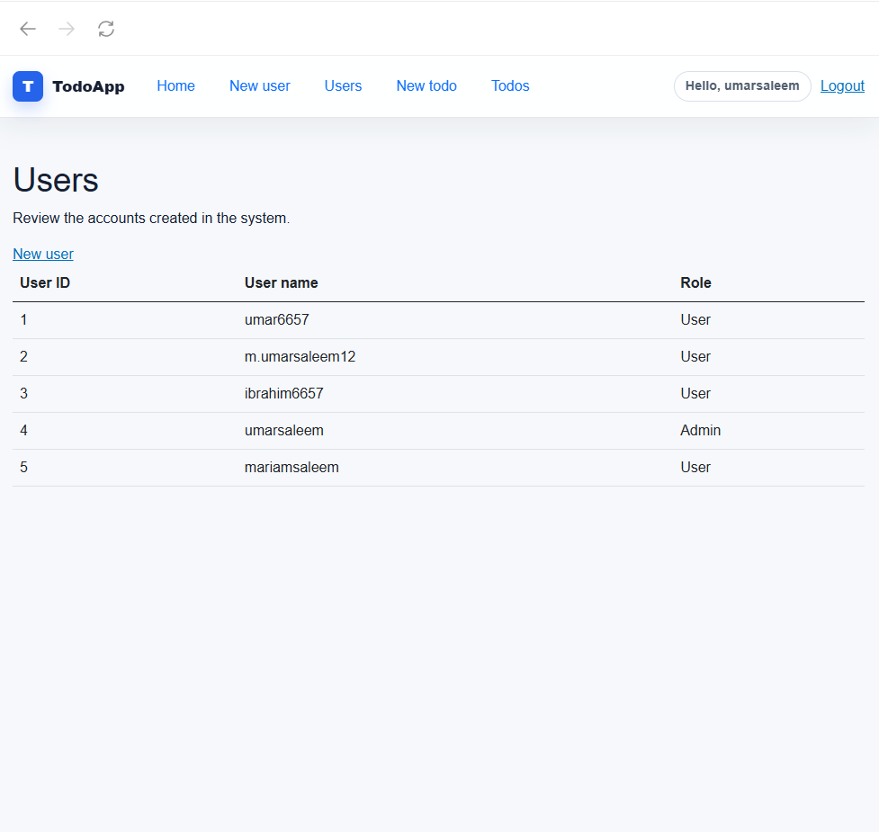
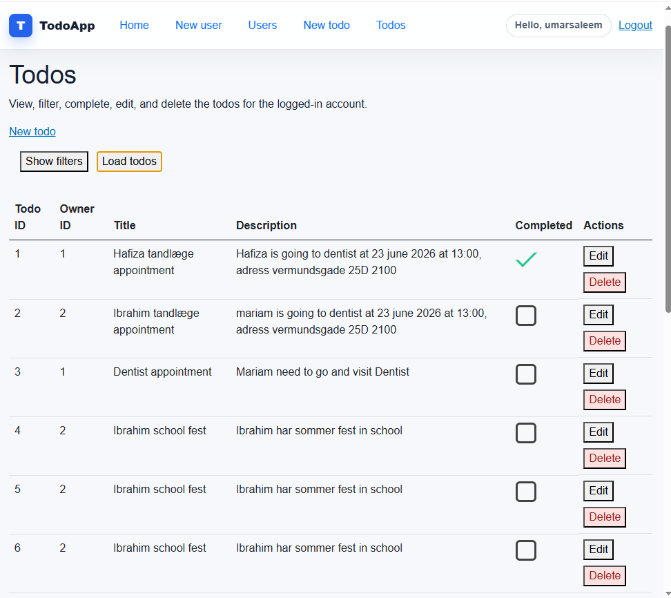
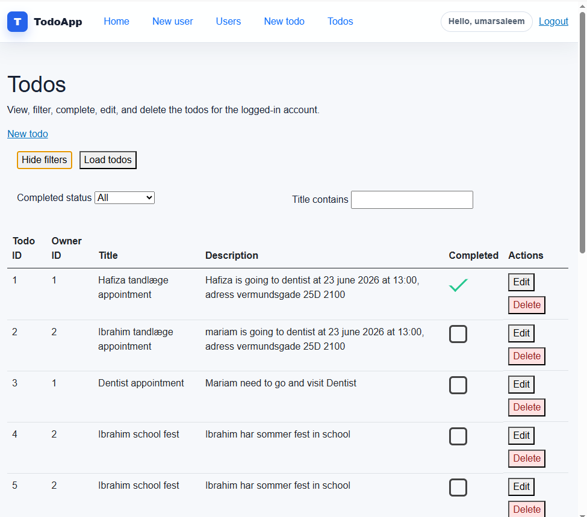
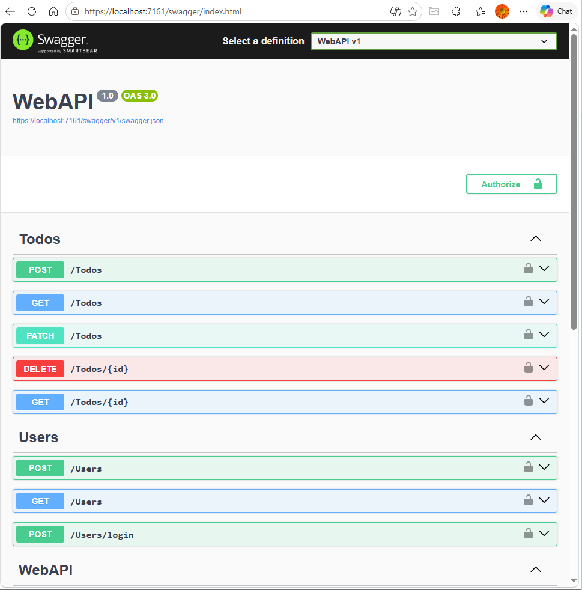
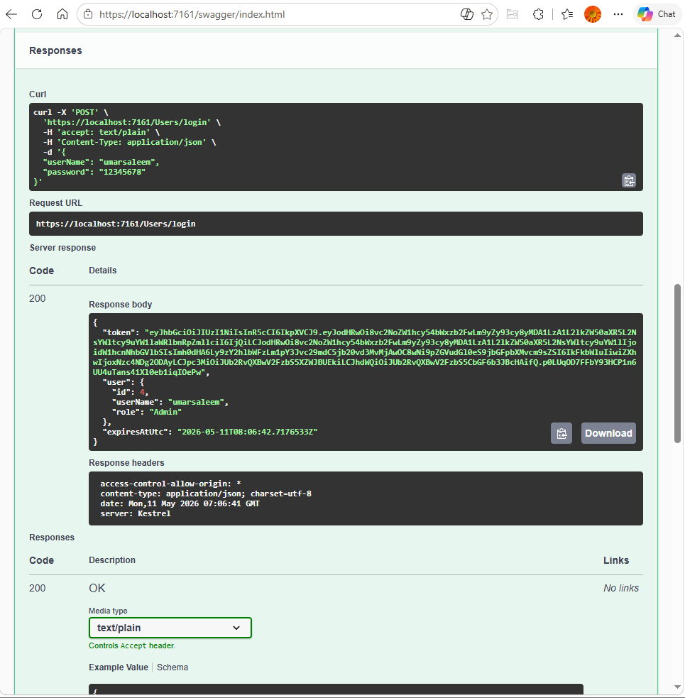
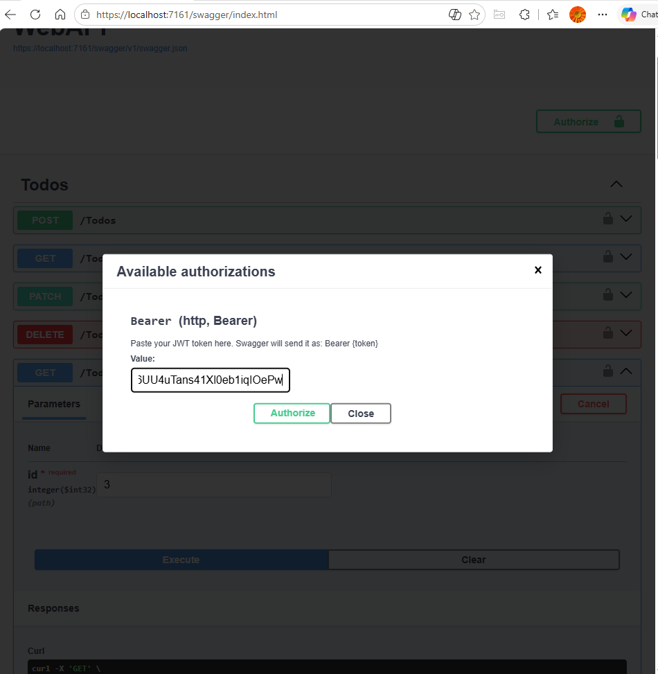
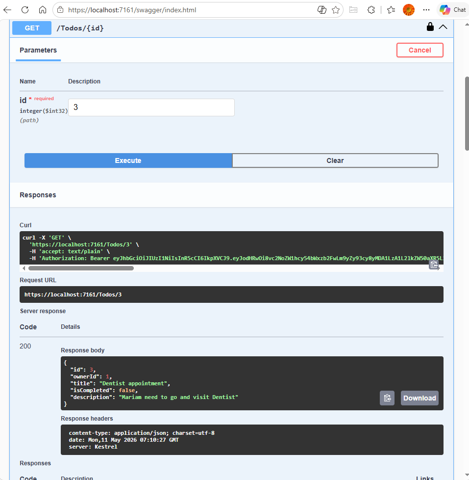

# TodoAppWasm

TodoAppWasm is a full-stack .NET 8 portfolio project built with Blazor WebAssembly, ASP.NET Core Web API, Entity Framework Core, JWT authentication, and role-based authorization.

The goal of this project is to show a realistic backend/frontend workflow: users can create accounts, log in, receive a JWT token, and manage protected Todo data through both the Blazor UI and Swagger.

## Screenshots

### Blazor WebAssembly UI











### Swagger and JWT authorization









## Features

- Blazor WebAssembly frontend
- ASP.NET Core Web API backend
- Entity Framework Core data access
- SQLite for local development
- PostgreSQL-ready configuration for hosted deployment
- JWT login flow
- Password hashing with PBKDF2
- Role support for `User` and `Admin`
- Protected Todo endpoints
- Swagger support for authenticated API testing
- Docker-ready backend
- GitHub Actions workflows for CI/CD
- GitHub Pages plan for frontend deployment
- Render plan for backend deployment

## Solution structure

```text
TodoAppWasm
|-- BlazorApp       # Blazor WebAssembly frontend
|-- WebAPI          # ASP.NET Core Web API
|-- Application     # Business logic
|-- EfcDataAccess   # EF Core DbContext, DAOs, migrations
|-- HttpClients     # Frontend HTTP client services
|-- Shared          # Shared DTOs, models, auth constants
|-- Tests           # Test project
`-- docs            # Portfolio, deployment, and screenshot docs
```

## Local development

Run the backend:

```bash
dotnet run --project WebAPI/WebAPI.csproj
```

Run the frontend:

```bash
dotnet run --project BlazorApp/BlazorApp.csproj
```

Open the Blazor app:

```text
http://localhost:5101
```

Open Swagger:

```text
https://localhost:7161/swagger
```

## Authentication flow

1. Create a user from Blazor or Swagger.
2. Log in through `POST /Users/login`.
3. The API returns a JWT token.
4. Blazor stores the token in browser local storage.
5. Todo API requests send the token as `Authorization: Bearer <token>`.
6. The backend reads the user id and role from the token before allowing Todo actions.

## Swagger protected endpoint testing

1. Call `POST /Users/login`.
2. Copy the returned token.
3. Click **Authorize** in Swagger.
4. Paste `Bearer <token>`.
5. Test protected Todo endpoints.

## Deployment plan

- **Frontend:** GitHub Pages
- **Backend:** Render Web Service
- **Docker image:** GitHub Container Registry
- **Database:** PostgreSQL for hosted deployment

Render was selected for the backend because the WebAPI is prepared as a Dockerized ASP.NET Core service. GitHub Pages is used for the static Blazor WebAssembly frontend.

## Important configuration

Frontend production API URL:

```bash
API_BASE_URL=https://<your-render-api-domain>/
```

Backend CORS:

```bash
AllowedOrigins=https://<your-username>.github.io
```

Backend JWT settings:

```bash
Jwt__Key=<long-random-secret-at-least-32-characters>
Jwt__Issuer=TodoAppWasm.WebAPI
Jwt__Audience=TodoAppWasm.BlazorApp
```

Local SQLite:

```bash
DatabaseProvider=Sqlite
ConnectionStrings__TodoDatabase=Data Source=../EfcDataAccess/Todo.db
```

Hosted PostgreSQL:

```bash
DatabaseProvider=Postgres
ConnectionStrings__TodoDatabase=<connection-string-from-your-database-host>
```

## CI/CD

- Generic CI: `.github/workflows/ci.yml`
- Development CI and container publish: `.github/workflows/development-ci.yml`
- GitHub Pages deploy: `.github/workflows/blazor-github-pages.yml`

## Documentation

- Portfolio strategy: [docs/PORTFOLIO_SHOWCASE_GUIDE.md](docs/PORTFOLIO_SHOWCASE_GUIDE.md)
- Deployment details: [docs/DEPLOYMENT_PLAYBOOK.md](docs/DEPLOYMENT_PLAYBOOK.md)
- Project roadmap: [docs/PROJECT_ROADMAP.md](docs/PROJECT_ROADMAP.md)
- Auth/JWT junior guide: [docs/AUTH_JWT_JUNIOR_GUIDE.html](docs/AUTH_JWT_JUNIOR_GUIDE.html)
- Screenshot guide: [docs/screenshots/README.md](docs/screenshots/README.md)

## Current status

The backend authentication and protected Todo workflow are implemented. The Blazor UI has been updated with a cleaner portfolio-style layout, top navigation, and authenticated Todo flow.
