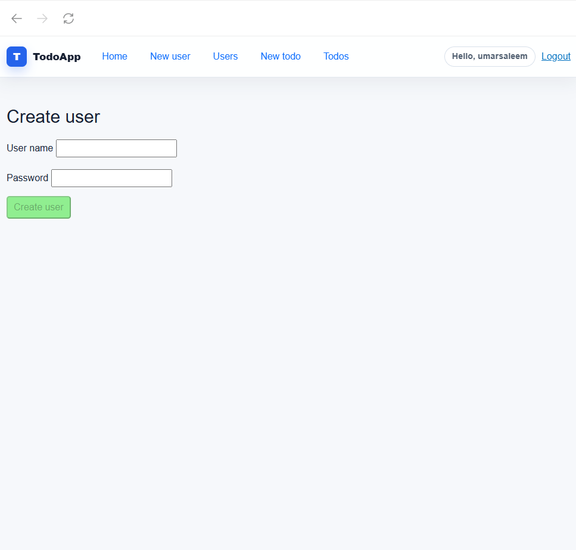

# TodoAppWasm

TodoAppWasm is a deployed full-stack .NET 8 portfolio project that demonstrates a real Blazor WebAssembly frontend, ASP.NET Core Web API backend, PostgreSQL persistence, JWT authentication, Docker deployment, and CI/CD automation.

Recruiters and reviewers can open the live app, test the backend health endpoint, inspect Swagger, create a demo user, log in, and verify protected Todo API flows.

## Live demo links

- **Frontend:** https://umarsalem.github.io/TodoAppWasm/
- **Backend health:** https://todoappwasm-api.onrender.com/health
- **Swagger:** https://todoappwasm-api.onrender.com/swagger

The API is hosted on Render free tier, so the first request may take a moment after idle time.

## Screenshots

Screenshots are stored in `docs/screenshots/`. Existing screenshots are used below; missing screenshots are marked with TODO placeholders instead of fake images.

### Login/Register screen




### Todo list screen


### Create/Edit todo screen

TODO: Add deployed app screenshots for creating and editing Todo items.

Suggested paths:

- `docs/screenshots/04-create-todo.png`
- `docs/screenshots/05-edit-todo.png`

### Swagger/API screen


## Architecture overview

```text
Blazor WebAssembly frontend
  Hosted on GitHub Pages
  Reads ApiBase from appsettings
  Sends JWT-authenticated requests to the API

ASP.NET Core Web API backend
  Hosted on Render
  Exposes REST endpoints and Swagger
  Validates JWT tokens and role-based authorization

PostgreSQL database
  Used by the hosted backend through Entity Framework Core

GitHub Actions CI/CD
  Builds and tests the solution
  Publishes the Web API Docker image to GitHub Container Registry
  Deploys the Blazor WebAssembly frontend to GitHub Pages
  Triggers Render deployment for the backend image
```

## Tech stack

- .NET 8
- Blazor WebAssembly
- ASP.NET Core Web API
- Entity Framework Core
- PostgreSQL for hosted deployment
- SQLite for local development
- JWT authentication
- Role-based authorization
- Swagger/OpenAPI
- Docker
- GitHub Actions
- GitHub Container Registry
- GitHub Pages
- Render
- xUnit tests

## Key features

- User registration and login
- JWT token generation and validation
- Protected Todo endpoints
- Todo create, read, update, delete, and filtering flows
- Password hashing with PBKDF2
- Role support for `User` and `Admin`
- Central API error handling
- Swagger support for testing authenticated endpoints
- Configurable database provider for local and hosted environments
- Dockerized backend service
- Automated build, test, image publish, and deployment workflows

## Local setup instructions

Prerequisites:

- .NET 8 SDK
- Optional: Docker Desktop
- Optional: PostgreSQL, if you want to test the hosted database provider locally

Restore, build, and test the solution:

```bash
dotnet restore TodoAppWasm.sln
dotnet build TodoAppWasm.sln
dotnet test TodoAppWasm.sln
```

Run the backend API:

```bash
dotnet run --project WebAPI/WebAPI.csproj
```

Run the Blazor WebAssembly frontend:

```bash
dotnet run --project BlazorApp/BlazorApp.csproj
```

Local URLs:

- **Frontend:** `http://localhost:5101`
- **Swagger:** `https://localhost:7161/swagger`

After both projects are running, create a demo user, log in, and use the Todo screens from the Blazor frontend. You can also test the same flow through Swagger by calling `POST /Users/login`, copying the JWT token, and using Swagger's Authorize button.

## Configuration/environment notes

Do not commit real production connection strings, database passwords, JWT signing keys, GitHub tokens, Render API keys, or other private values.

Frontend configuration:

- `ApiBase` is the Blazor app setting used at runtime.
- `API_BASE_URL` is the GitHub Actions secret used during GitHub Pages deployment.
- The GitHub Pages workflow writes `API_BASE_URL` into `BlazorApp/wwwroot/appsettings.Production.json` as `ApiBase`.

Example frontend value:

```bash
API_BASE_URL=https://todoappwasm-api.onrender.com/
```

Backend database configuration:

```bash
DatabaseProvider=Sqlite
ConnectionStrings__TodoDatabase=Data Source=../EfcDataAccess/Todo.db
```

Hosted backend database configuration:

```bash
DatabaseProvider=Postgres
ConnectionStrings__TodoDatabase=<postgres-connection-string>
ApplyMigrationsOnStartup=true
```

JWT configuration:

```bash
Jwt__Key=<long-random-secret>
Jwt__Issuer=TodoAppWasm.WebAPI
Jwt__Audience=TodoAppWasm.BlazorApp
Jwt__TokenLifetimeMinutes=60
```

Other hosted backend settings:

```bash
AllowedOrigins=https://umarsalem.github.io
```

## Testing and CI/CD

The repository includes automated tests in the `Tests` project. The CI workflows restore dependencies, build the solution, and run tests.

Workflow files:

- `.github/workflows/ci.yml` runs restore, build, and test on push and pull request.
- `.github/workflows/development-ci.yml` builds and tests the solution, builds the Web API Docker image, publishes it to GitHub Container Registry, and triggers the Render staging deployment on development branch pushes.
- `.github/workflows/blazor-github-pages.yml` publishes the Blazor WebAssembly frontend to GitHub Pages from the main branch.

## Deployment explanation

The frontend and backend are deployed separately because Blazor WebAssembly is a static frontend and the ASP.NET Core API is a server-side application.

- **GitHub Pages frontend:** hosts the published Blazor WebAssembly static files.
- **Render backend:** runs the ASP.NET Core Web API as a Dockerized web service.
- **GHCR Docker image:** stores the backend image built by GitHub Actions.
- **PostgreSQL:** stores hosted application data for the Render API.

The deployed Blazor app calls the Render API through the configured `ApiBase` URL. The API validates JWT tokens, applies authorization rules, and stores Todo data through Entity Framework Core.

## Known limitations

- The API is hosted on Render free tier, so the first request may take a moment after idle time.
- This is a portfolio/staging demo, not a production system.
- Demo data may be reset or changed during development.
- The UI and API are built to show full-stack capability, not to replace a production task management product.

## Roadmap / next improvements

- Add updated create/edit Todo screenshots from the deployed frontend.
- Add a dedicated deployed Swagger screenshot with the live Render URL visible.
- Improve form validation feedback in the Blazor UI.
- Add refresh token support or token renewal.
- Add pagination for larger Todo lists.
- Add more end-to-end tests for the hosted authentication and Todo flows.
- Add monitoring/logging notes for the Render deployment.

## Author/contact section

Created by **Umar Salem** as a full-stack .NET portfolio project.

- **Live frontend:** https://umarsalem.github.io/TodoAppWasm/
- **Swagger/API:** https://todoappwasm-api.onrender.com/swagger

I used AI coding tools as a development assistant, but I reviewed, tested, debugged, deployed, and integrated the application myself.
