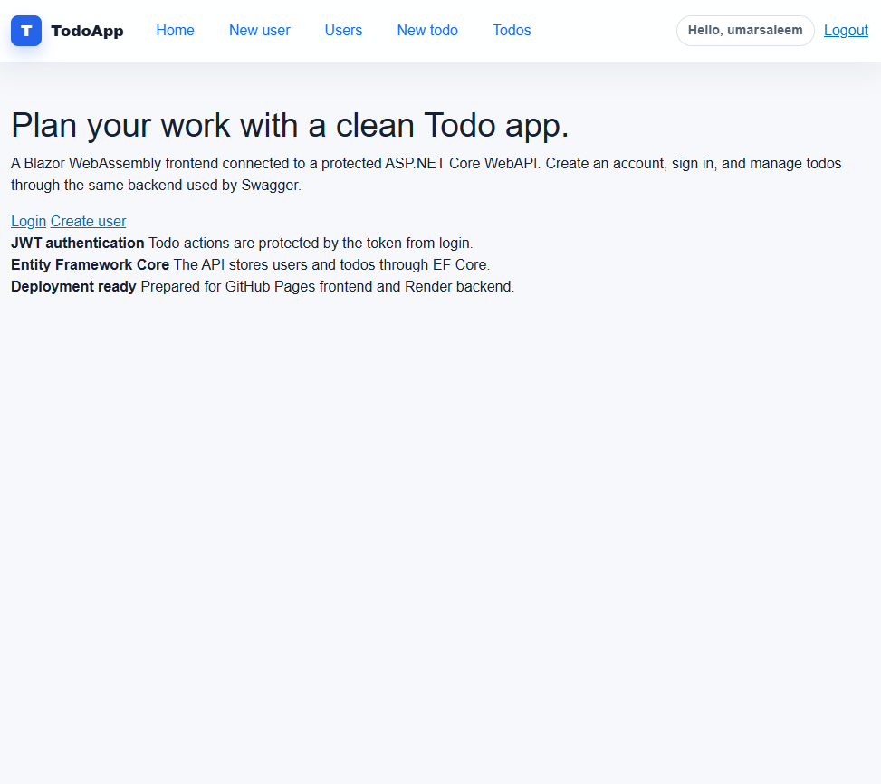
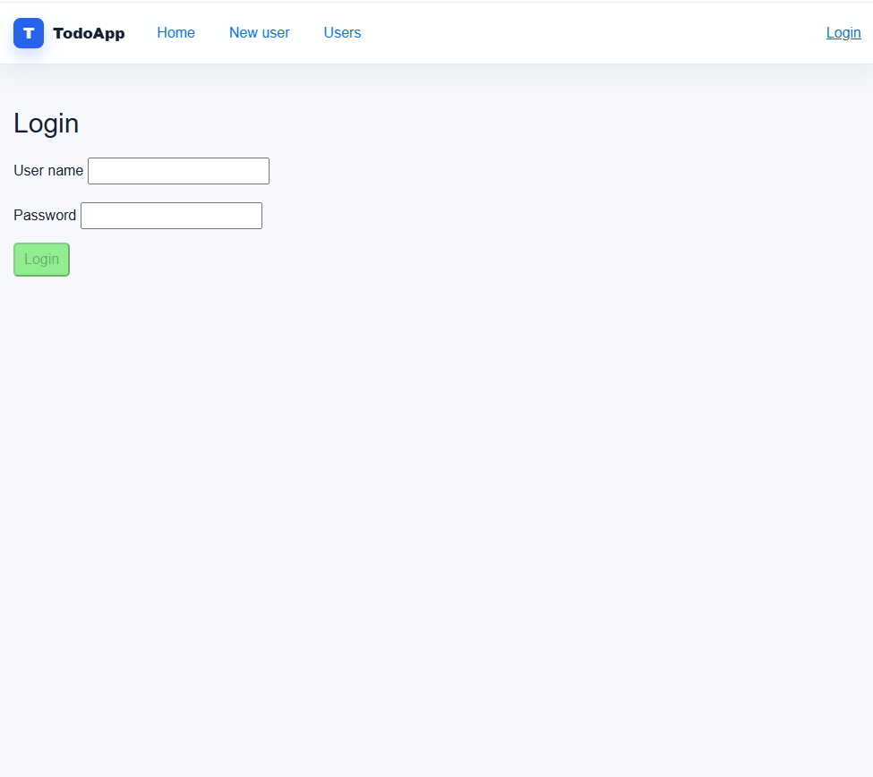
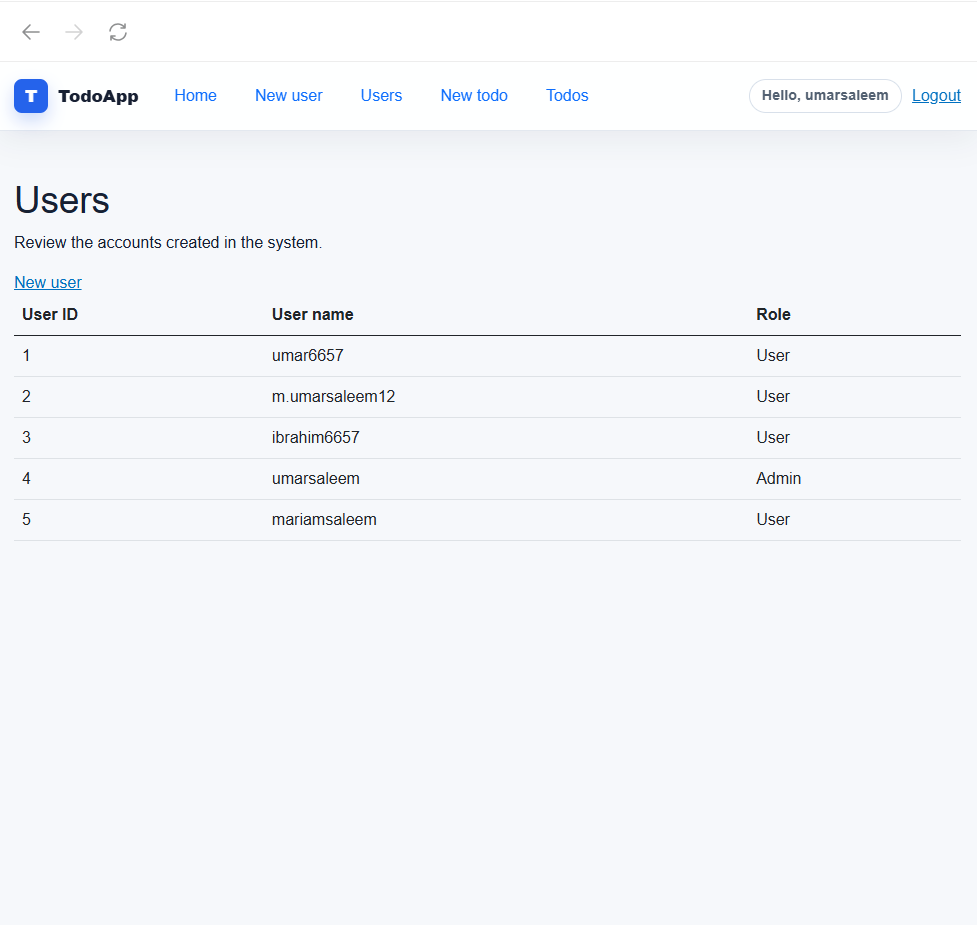
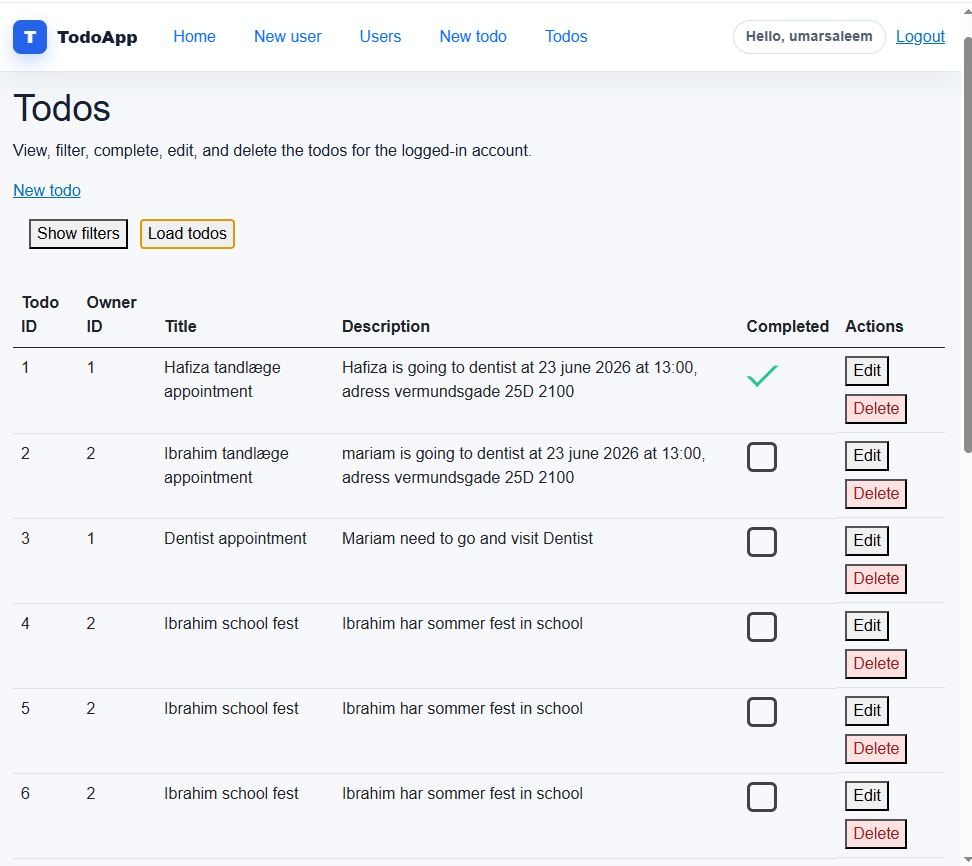
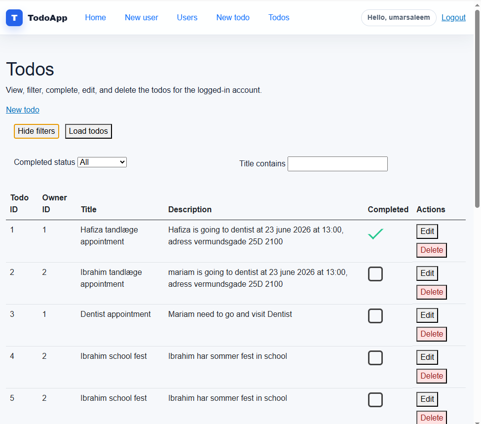
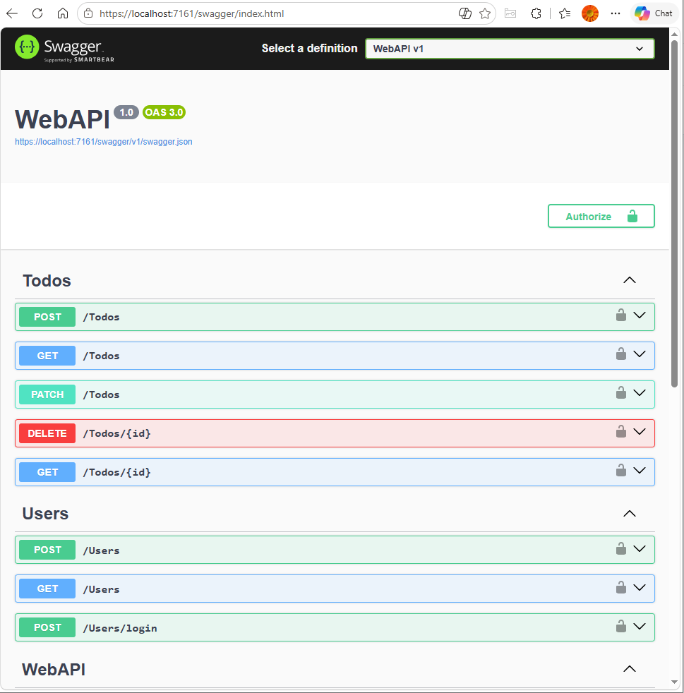
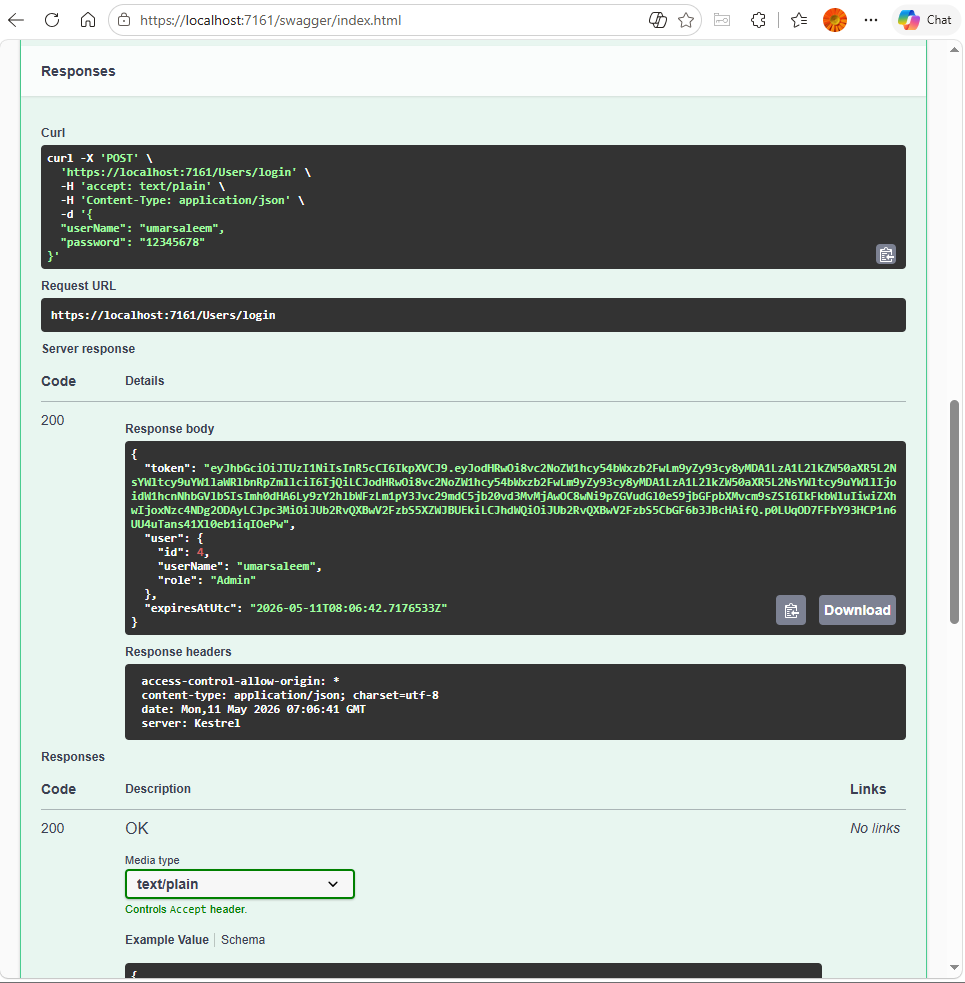
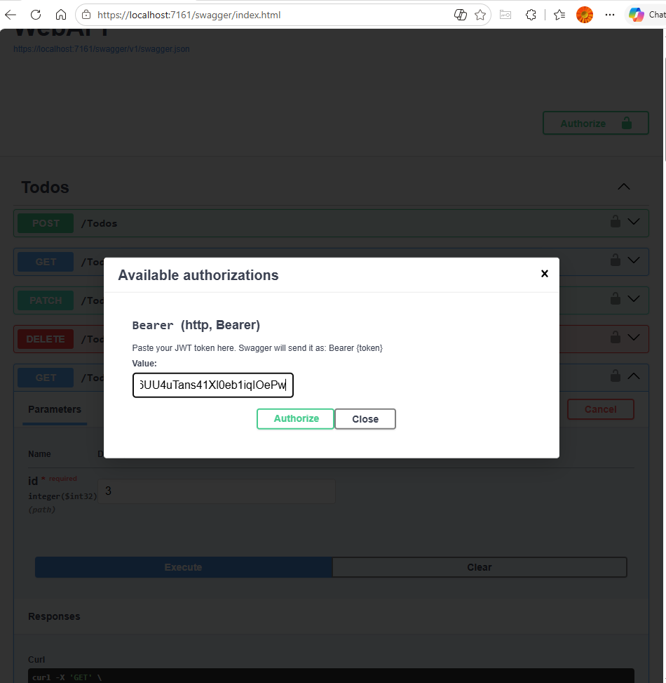
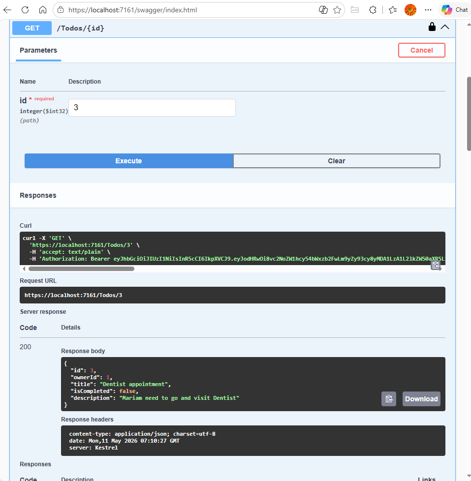

# TodoAppWasm

TodoAppWasm is a full-stack .NET 8 portfolio project built with Blazor WebAssembly, ASP.NET Core Web API, Entity Framework Core, PostgreSQL, JWT authentication, and role-based authorization.

The project demonstrates a realistic frontend/backend workflow: users can create accounts, log in, receive a JWT token, and manage protected Todo data through both the Blazor UI and Swagger.

## Live demo

- **Frontend:** https://umarsalem.github.io/TodoAppWasm/
- **Backend health check:** https://todoappwasm-api.onrender.com/health
- **Swagger API docs:** https://todoappwasm-api.onrender.com/swagger

The backend is hosted on Render's free tier, so the first request may take several seconds if the service has been idle.

## Screenshots

### Blazor WebAssembly UI











### Swagger and JWT authorization









## Features

- Blazor WebAssembly frontend hosted on GitHub Pages
- ASP.NET Core Web API backend hosted on Render
- Entity Framework Core data access
- SQLite for local development
- PostgreSQL for hosted deployment
- JWT login flow
- Password hashing with PBKDF2
- Role support for `User` and `Admin`
- Protected Todo endpoints
- Swagger support for authenticated API testing
- Dockerized backend
- GitHub Actions workflows for CI/CD
- GitHub Container Registry image publishing

## Architecture

```text
GitHub Pages frontend
  -> calls Render Web API
  -> Web API validates JWT tokens
  -> Entity Framework Core stores data in PostgreSQL

GitHub Actions
  -> builds and tests the solution
  -> publishes the backend Docker image to GHCR
  -> deploys the Blazor frontend to GitHub Pages
```

## Solution structure

```text
TodoAppWasm
|-- BlazorApp       # Blazor WebAssembly frontend
|-- WebAPI          # ASP.NET Core Web API
|-- Application     # Business logic
|-- EfcDataAccess   # EF Core DbContext, DAOs, SQLite migrations
|-- EfcDataAccess.Postgres # PostgreSQL migrations
|-- HttpClients     # Frontend HTTP client services
|-- Shared          # Shared DTOs, models, auth constants
|-- Tests           # Test project
`-- docs            # Portfolio, deployment, and screenshot docs
```

## Local development

Run the backend:

```bash
dotnet run --project WebAPI/WebAPI.csproj
```

Run the frontend:

```bash
dotnet run --project BlazorApp/BlazorApp.csproj
```

Open the Blazor app:

```text
http://localhost:5101
```

Open Swagger:

```text
https://localhost:7161/swagger
```

## Authentication flow

1. Create a user from Blazor or Swagger.
2. Log in through `POST /Users/login`.
3. The API returns a JWT token.
4. Blazor stores the token in browser local storage.
5. Todo API requests send the token as `Authorization: Bearer <token>`.
6. The backend reads the user id and role from the token before allowing Todo actions.

## Swagger protected endpoint testing

1. Open https://todoappwasm-api.onrender.com/swagger.
2. Call `POST /Users/login`.
3. Copy the returned token.
4. Click **Authorize** in Swagger.
5. Paste `Bearer <token>`.
6. Test a protected Todo endpoint.

## Deployment

- **Frontend:** GitHub Pages
- **Backend:** Render Web Service
- **Docker image:** GitHub Container Registry
- **Database:** Render PostgreSQL

Render was selected for the backend because the WebAPI is prepared as a Dockerized ASP.NET Core service. GitHub Pages is used for the static Blazor WebAssembly frontend.

## Important configuration

Frontend production API URL:

```bash
API_BASE_URL=https://todoappwasm-api.onrender.com/
```

Backend CORS:

```bash
AllowedOrigins=https://umarsalem.github.io
```

Backend JWT settings:

```bash
Jwt__Key=<long-random-secret-at-least-32-characters>
Jwt__Issuer=TodoAppWasm.WebAPI
Jwt__Audience=TodoAppWasm.BlazorApp
Jwt__TokenLifetimeMinutes=60
```

Local SQLite:

```bash
DatabaseProvider=Sqlite
ApplyMigrationsOnStartup=false
ConnectionStrings__TodoDatabase=Data Source=../EfcDataAccess/Todo.db
```

Hosted PostgreSQL:

```bash
DatabaseProvider=Postgres
ApplyMigrationsOnStartup=true
ConnectionStrings__TodoDatabase=<postgres-connection-string>
```

Do not commit real production connection strings, database passwords, or JWT secrets.

## CI/CD

- Generic CI: `.github/workflows/ci.yml`
- Development CI and container publish: `.github/workflows/development-ci.yml`
- GitHub Pages deploy: `.github/workflows/blazor-github-pages.yml`

The development workflow builds and tests the solution, builds a Linux Docker image for the WebAPI, and pushes it to GitHub Container Registry.

## Documentation

- Portfolio strategy: [docs/PORTFOLIO_SHOWCASE_GUIDE.md](docs/PORTFOLIO_SHOWCASE_GUIDE.md)
- Deployment details: [docs/DEPLOYMENT_PLAYBOOK.md](docs/DEPLOYMENT_PLAYBOOK.md)
- Render deployment checklist: [docs/RENDER_DEPLOYMENT_CHECKLIST.md](docs/RENDER_DEPLOYMENT_CHECKLIST.md)
- Frontend live backend checklist: [docs/FRONTEND_LIVE_BACKEND_CHECKLIST.md](docs/FRONTEND_LIVE_BACKEND_CHECKLIST.md)
- PostgreSQL hosting guide: [docs/POSTGRES_HOSTING_GUIDE.md](docs/POSTGRES_HOSTING_GUIDE.md)
- Project roadmap: [docs/PROJECT_ROADMAP.md](docs/PROJECT_ROADMAP.md)
- Auth/JWT junior guide: [docs/AUTH_JWT_JUNIOR_GUIDE.html](docs/AUTH_JWT_JUNIOR_GUIDE.html)
- Screenshot guide: [docs/screenshots/README.md](docs/screenshots/README.md)

## Current status

The application is deployed and working end to end. The Blazor WebAssembly frontend is hosted on GitHub Pages, the ASP.NET Core Web API is hosted on Render, and hosted data is stored in PostgreSQL.
